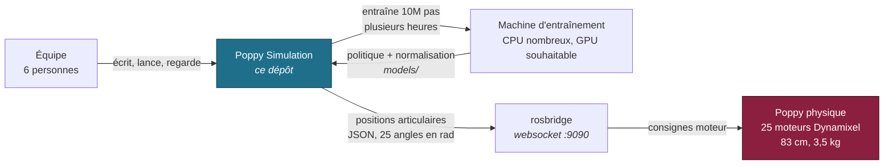
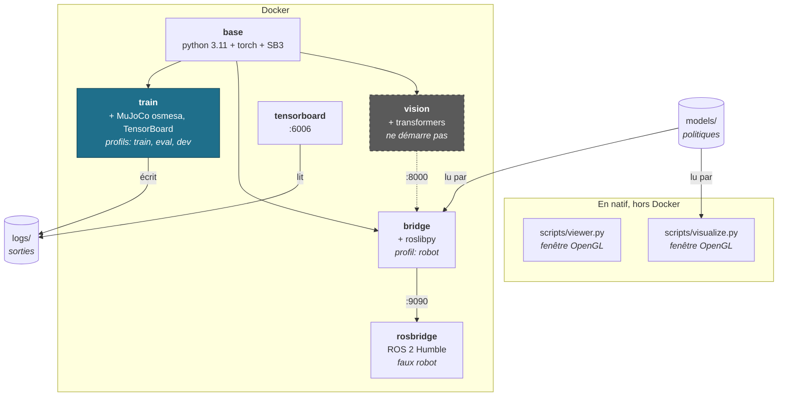
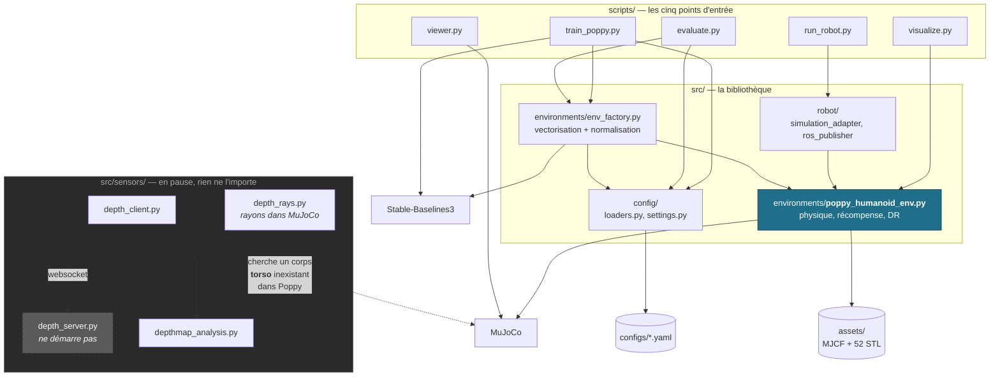

# Architecture

Comment c'est construit, et où se trouve quoi. À lire avant de toucher à
`src/environments/poppy_humanoid_env.py`.

Les diagrammes suivent le modèle **C4** : on zoome progressivement, du contexte
général jusqu'aux modules. Ils sont en Mermaid — GitHub les rend directement, il n'y a
aucun outil à installer et aucune image à régénérer quand le code bouge.

---

## Niveau 1 — Contexte

Qui parle à quoi. Le dépôt produit une politique ; le robot la consomme.



**La flèche qui n'existe pas encore** : rien ne remonte du robot vers le dépôt. La
boucle est ouverte — on envoie des consignes, on ne lit aucun état réel. Et ce pont
n'a jamais parlé à un vrai robot, seulement au faux `rosbridge` de la pile compose.

---

## Niveau 2 — Conteneurs

Quatre images Docker, un socle commun, plus deux outils qui tournent en natif.



`vision` est en pointillés : l'image se construit, mais le serveur s'arrête à l'import
(`depth_anything_3` absent de PyPI).

`viewer.py` et `visualize.py` sont hors Docker délibérément : faire sortir une fenêtre
OpenGL d'un conteneur sous Windows demande un serveur X pour zéro bénéfice.

Le détail de chaque image — cibles, arguments de build, volumes — est dans
[`DOCKER.md`](DOCKER.md).

---

## Niveau 3 — Composants

Les modules Python et **les imports réels** entre eux. C'est ce diagramme qui répond à
« la vision, c'est où ? ».



**Ce qu'il faut retenir du diagramme :**

- `poppy_humanoid_env.py` est le seul module que tout traverse. Le modifier touche
  l'entraînement, l'évaluation, la visualisation **et** le robot.
- `src/sensors/` est un **îlot** : aucune flèche ne part de `scripts/` ni de `src/`
  vers lui. La vision n'est branchée sur rien. Son état détaillé est dans
  [`../src/sensors/README.md`](../src/sensors/README.md).
- `viewer.py` ne passe pas par `src/` du tout : il charge le MJCF avec `mujoco` brut.
  C'est voulu — il doit marcher même si `src/` est cassé.

---

## Le contrat observation → action

**C'est le contrat à connaître avant toute modification.** Le changer invalide tous
les modèles entraînés : une politique chargée avec un espace d'observation différent
échoue sur `spaces must have the same shape`.

### Observation — 63 dimensions, `float64`

| Indices | Contenu | Unité |
|---|---|---|
| `0` | Hauteur du bassin (z) | m |
| `1:5` | Quaternion de la racine (w, x, y, z) | — |
| `5:30` | Position des 25 articulations | rad |
| `30:36` | Vitesse de la racine (3 linéaires + 3 angulaires) | m/s, rad/s |
| `36:61` | Vitesse des 25 articulations | rad/s |
| `61:63` | Force de contact, pied droit puis pied gauche | N |

Soit `qpos[2:]` (30 valeurs — les positions globales x et y sont volontairement
exclues, pour que la politique ne dépende pas de l'endroit où le robot se trouve),
puis `qvel` (31), puis les deux contacts.

### Action — 25 dimensions, une par articulation

Une action est une **position cible**, pas un couple. Le trajet complet :

```
action ∈ [-1, 1]
   │  action = 0  → pose debout par défaut (init_qpos)
   │  action = +1 → limite mécanique haute
   │  action = -1 → limite mécanique basse
   ▼
position cible  (rad)
   │  PD :  τ = kp·(cible − q) − kd·q̇      kp = 8 Nm/rad, kd = 0,5 Nm·s/rad
   ▼
couple  (Nm)
   │  bornage sur actuator_ctrlrange (max ≈ 3,1 Nm)
   ▼
MuJoCo, frame_skip = 5 pas de 2 ms → 10 ms par pas de politique
```

Le contrôle en **position** plutôt qu'en couple est un choix de conception, pas un
détail : c'est ce que fait un servomoteur Dynamixel réel, qui a sa propre boucle PID
interne. Une politique entraînée en couple ne se transférerait pas.

⚠️ `action_space` **n'est pas** `[-1, 1]` en réalité — voir
[`TECHNIQUE.md` §8](TECHNIQUE.md#8-ce-qui-est-cassé-et-connu).

### Récompense — huit termes

| Terme | Signe | Ce que ça encourage |
|---|:---:|---|
| `forward_reward` | + | Avancer. Plafonné à 0,5 m/s pour éviter les foulées absurdes. |
| `healthy_reward` | + | Rester dans la plage de hauteur (ne pas tomber) |
| `upright_reward` | + | Garder le buste vertical |
| `gait_reward` | + | Alterner les appuis : 0,3 si un seul pied touche, 0,1 si les deux |
| `lateral_cost` | − | Dériver sur le côté |
| `ctrl_cost` | − | Actions de grande amplitude |
| `action_rate_cost` | − | Changements brusques entre deux actions |
| `joint_vel_cost` | − | Articulations qui tournent vite |

`healthy` et `upright` rapportent chacun jusqu'à 1000 par épisode complet, quand
`forward` en rapporte quelques dizaines. **Ce déséquilibre a une conséquence
mesurée** : la politique la mieux notée du dépôt reste debout sans marcher. Voir
[`../models/README.md`](../models/README.md).

### Randomisation de domaine

Ré-échantillonnée à chaque `reset()`, uniquement quand `floor_noise=True` :
friction du sol, masses des corps (±15 %), orientation initiale (±15°), et poussées
externes aléatoires sur le bassin (~2 % des pas). Elle sert le transfert vers le réel :
une politique qui ne tient que sur un sol parfait ne tiendra pas sur un vrai plancher.

La restitution est censée être randomisée aussi, mais ne l'est pas — bug documenté
dans [`TECHNIQUE.md` §8](TECHNIQUE.md#8-ce-qui-est-cassé-et-connu).

---

## La frontière simulation / réel

```
SIMULATION                          │  RÉEL
                                    │
politique  ──►  action [-1,1]       │
                    │               │
                    ▼               │
            PD → couple → MuJoCo    │
                    │               │
                    ▼               │
         positions articulaires ────┼──►  JSON {motor_ids, angles_rad}
                  (rad)             │      25 noms, 25 angles
                                    │              │
                                    │              ▼
                                    │     rosbridge :9090
                                    │              │
                                    │              ▼
                                    │     servos Dynamixel
                                    │
                    ◄───────────────┼───  (rien ne revient)
```

`SimulationAdapter` déroule la simulation et publie, après chaque pas, les 25
positions articulaires. Ce qu'il envoie est **ce que la simulation a obtenu**, pas ce
que la politique a demandé — le PD et la physique se sont interposés.

Trois choses à savoir avant de brancher un vrai robot :

1. **Boucle ouverte.** Aucun état réel n'est relu. Si un moteur bloque, rien ne le sait.
2. **Période de contrôle par défaut : 5 secondes** (`POPPY_CONTROL_PERIOD_S`), alors
   que la simulation avance de 10 ms par pas. C'est un réglage de sécurité, pas un
   régime de marche.
3. **La cible par défaut est le faux robot**, jamais une adresse réelle. Viser un vrai
   robot demande de définir `POPPY_ROSBRIDGE_HOST` explicitement. C'est une règle, pas
   un défaut de configuration — voir [`../CONTRIBUTING.md`](../CONTRIBUTING.md).
